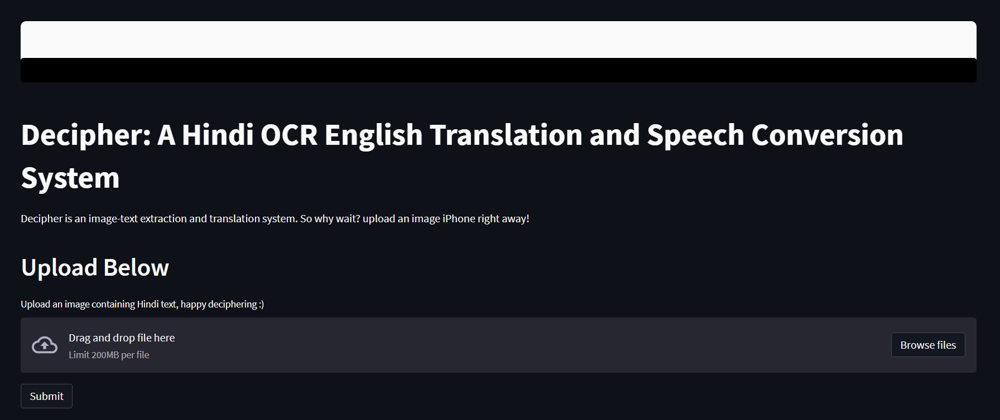

# Decipher
Decipher is an A Hindi Image to English Audio Translator web application. It takes an image containing Hindi text as an input, extracts text from the image using Pytesseract, translates it into a English using Seq2Seq Neural Machine Translation model that has been trained in a Hindi-English parallel corpus; furthermore the system converts the so translated English text to speech and allowa the user to download the audio file.

The initial interface of the product is shown below:  

After having uploaded the image, this is how the final results look like:  

